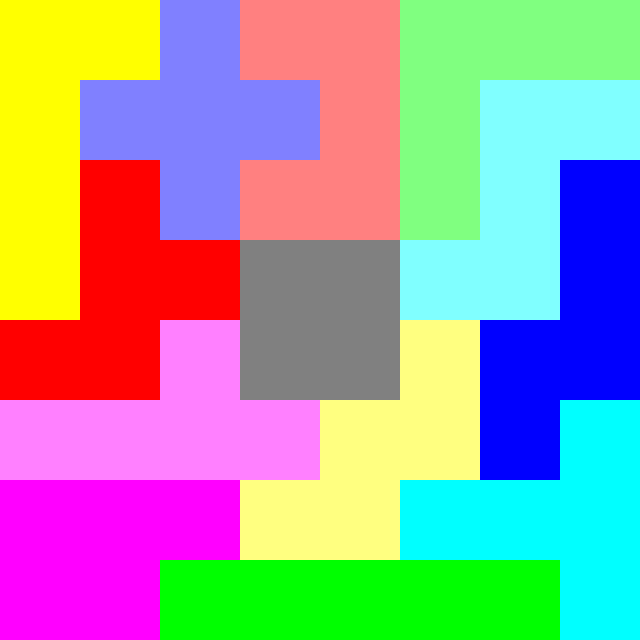

# Dancing Links in C

This is a C implementation of Donald Knuth's [Dancing Links (DLX)](https://arxiv.org/pdf/cs/0011047) algorithm.
This implementation is suited for solving exact cover problems like [Polyomino](https://de.wikipedia.org/wiki/Polyomino), the [N-Queens Problem](https://en.wikipedia.org/wiki/Eight_queens_puzzle), Sudoku and many more.

## Quick Start
```console
$ ./build.sh
```

The implementation itself reads from `stdin` and outputs solution to `stdout`.
The input must cohere to the following protocol:
```txt
<number_rows> <number_columns> <number_mandatories>\n
<matrix>...
```
Exemplary input matrices are generated by the python script `matrix_builder.py` in `pentomino_sols` and in `n_queens_sols`.
Dlx outputs the solutions to `stdout`.
To see examples of further processing see `solution_printer.py` in `pentomino_sols` and `n_queens_sols`, which output `.ppm` images and formated chessboards to `stdout` respectivly.



The holes in the pentomino boards can be customized by providing a file to the scripts, which contains the coordinates of the holes.
The board dimentions can also be adjusted as the second and third argument.

```console
$ ../matrix_builder.py holes.dat | ../../dlx | ../solution_printer.
py holes.dat
```

The `N` of the N-Queens Problem can also be adjuted as an argument.
